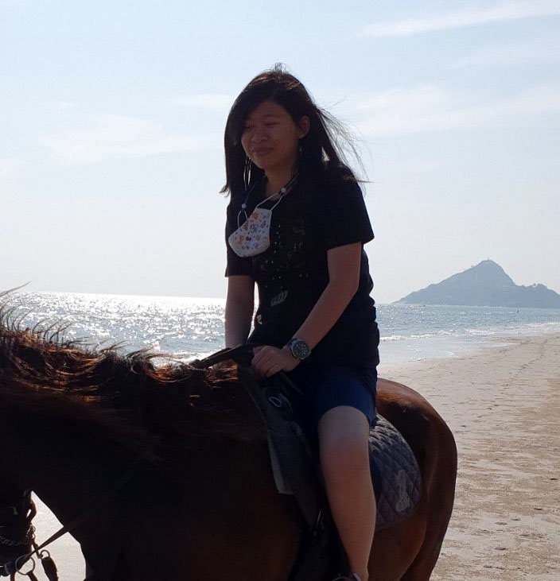

# Pattaramanee Arsomngern

ภัทรมณี อาศรมเงิน (Ploy)

## About
I am currently a 3rd year CS Ph.D. student from the School of Information Science and Technology@VISTEC, Thailand. I am working with Dr. [Supasorn Suwajanakorn](http://www.supasorn.com/) as a part of members in [Vision & Learning Lab (VLL)](https://vistec.ist/vision) and Assoc. Prof. Dr. [Sarana Nutanong](https://scholar.google.com/citations?user=fEPAC_AAAAAJ&hl=en) as a part of members in [SCAlable Data System lab (SCADS)](https://vistec.ist/scads). I also collaborate with Asst. Prof. Dr. [Cheng Long](https://personal.ntu.edu.sg/c.long/) from Nanyang Technological University (NTU), Singapore. My works are to conduct cutting-edge AI researches and prepare for the Ph.D. proposal examination. I was also selected to receive a special scholarship called "Srimedhi scholarship" from VISTEC and Thailand royal members for conducting research abroad. I am looking for a lab to join as a visiting Ph.D. student in 2022-2023.

## Bio
I received the B.Eng. degree in Computer engineering (first-class honor) from KMUTT, Thailand in 2019. My undergrad's final project is about anomaly detection on animal medical images, under the supervision of Asst. Prof. Dr. [Phond Phunchongharn](https://www.cpe.kmutt.ac.th/en/staff-detail/Phond). I did an internship during undergrad as a research assistant at Computer Networks and Communications Lab (CNCL)@NTU, and Chulabhorn Graduate Institute, Thailand.

## Research
My research interests are about deep representation learning in images, graphs, and sets.
* **Towards Pointsets Representation Learning via Self-Supervised Learning and Set Augmentation**

  P Arsomngern, C Long, S Suwajanakorn, S Nutanong

  *In IEEE Transactions on Pattern Analysis and Machine Intelligence, 2022* [paper] [[code]](https://github.com/vistec-AI/WSSET)

* **Self-Supervised Deep Metric Learning for Pointsets**

  P Arsomngern, C Long, S Suwajanakorn, S Nutanong

  *In IEEE International Conference on Data Engineering (ICDE), 2021* [[paper]](https://ieeexplore.ieee.org/abstract/document/9458827) [[code]](https://github.com/vistec-AI/WSSET)

* **Computer-aided diagnosis for lung lesion in companion animals from x-ray images using deep learning techniques**

  P Arsomngern, N Numcharoenpinij, J Piriyataravet, W Teerapan, W Hinthong, P Phunchongharn

  *In IEEE International Conference on Awareness Science and Technology (iCAST), 2019* [[paper]](https://ieeexplore.ieee.org/abstract/document/8923126)

  * Pet-X got 2nd prize (without first prize) at [Thailand National Software Contest (NSC)](http://fic.nectec.or.th/nsc21_Decisions), 2019, under the "Applications for science and technologies" category.
 
## Technical Skills
### Programming languages
* Python (professional)
* JavaScript, CSS, PHP, Java, C#, R (limited)

### Frameworks, tools and libraries
* PyTorch, Tensorflow2.X, Keras, PyTorch geometric, Tensorboard, matplotlib, numpy, scikit-learn, git, Linux (professional)
* Node.js, React.js, Unity, Google Cloud Platform (limited)

## Languages
* Thai (Native)
* English (B2)
* Japanese (JLPT N2)

## Contact
* pattaramanee.a_s19 at vistec dot ac dot th
* [Google Scholar](https://scholar.google.co.th/citations?user=xc-r7U8AAAAJ&hl=en)
* [DBLP](https://dblp.org/pid/256/8420.html)
* [Linkedin](https://www.linkedin.com/in/pattaramanee-arsomngern-053383167/?originalSubdomain=th)
